<div align="center">

# FPGA Algorithmic Trading System

**Sub-microsecond tick-to-trade for Nasdaq US equities, implemented in FPGA fabric.**

Market data arrives on a fibre. Roughly 300 nanoseconds later, if a strategy condition is met,
an order leaves on another fibre. No software in the path.

[](docs/SYSTEM-REPORT.md)
[](manuals/00-foundations/03-hdl-and-rtl-coding.md)
[](manuals/11-platform/)
[](manuals/08-nasdaq/)
[](https://github.com/mcelikx/fpga-algotrading/actions/workflows/validate.yml)

[Architecture](#architecture) · [Documentation](#documentation) · [Status](#status) · [Roadmap](#roadmap)

</div>

---

> [!WARNING]
> **This system has never been compiled, simulated, or run on hardware.**
>
> Every latency figure in this repository is arithmetic from a budget table, not a
> measurement. Every resource figure is a first-principles estimate — no synthesis has
> run. The order book has never been validated against its golden model.
>
> It is a complete, internally consistent *design*. It is not a working trading system,
> and in its current state it **cannot trade** — see [Known Limitations](#known-limitations).

---

## Contents

- [Why an FPGA](#why-an-fpga)
- [Architecture](#architecture)
- [Latency budget](#latency-budget)
- [Repository layout](#repository-layout)
- [Documentation](#documentation)
- [Getting started](#getting-started)
- [Status](#status)
- [Known limitations](#known-limitations)
- [Roadmap](#roadmap)
- [Design principles](#design-principles)
- [Disclaimer](#disclaimer)

---

## Why an FPGA

Not for throughput — a CPU decodes ITCH at line rate without difficulty. For **determinism**.

| | CPU (kernel bypass) | FPGA |
|---|---|---|
| p50 tick-to-trade | ~1–5 µs | ~300 ns *(target)* |
| p99.9 | 10–50 µs | ~300 ns *(target)* |
| Tail source | cache misses, interrupts, scheduling, NUMA | none — fixed pipeline |

You lose more money to the tail than to the mean. A slow quote gets picked off, and that
is a realized loss rather than a missed opportunity. **The fixed-latency pipeline is the
product.**

---

## Architecture

```mermaid
flowchart LR
    subgraph WIRE_IN [" "]
        MD["Nasdaq ITCH<br/>A / B multicast"]
    end

    subgraph FPGA ["FPGA — single SLR, one clock domain @ 156.25 MHz"]
        direction TB
        ETH["GT / PCS / cut-through MAC"]
        NET["A/B arbitration<br/>MoldUDP64 deframe"]
        FEED["ITCH decode<br/>symbol filter (1-cycle direct index)"]
        BOOK["ORDER BOOK<br/>order map + price levels<br/>incremental top-of-book"]
        STRAT["Strategy trigger<br/>parameter table"]
        RISK["🔒 PRE-TRADE RISK<br/>non-bypassable"]
        ORD["OUCH encode<br/>template splice + TCP"]
        ETH2["MAC / PCS / GT"]

        ETH --> NET --> FEED --> BOOK --> STRAT --> RISK --> ORD --> ETH2
    end

    subgraph HOST ["Host — slow path only, over PCIe"]
        direction TB
        H1["Control &amp; arming"]
        H2["Strategy parameters"]
        H3["Risk limits"]
        H4["Position reconciliation"]
        H5["Session ownership<br/>gap recovery"]
        H6["Audit log / CAT"]
    end

    MD --> ETH
    ETH2 --> OUT["Nasdaq OUCH<br/>order entry"]
    HOST -. "PCIe — never in the trading path" .-> FPGA

    style RISK fill:#c0392b,stroke:#7b241c,color:#fff
    style BOOK fill:#1f618d,stroke:#154360,color:#fff
    style FPGA fill:#f4f6f7,stroke:#5d6d7e
    style HOST fill:#fef9e7,stroke:#b7950b
```



### The central idea

**The FPGA is a trigger evaluator over a parameter table, not a compute engine.**

The host computes signals at millisecond cadence and writes parameters. The FPGA compares
book state against those parameters at nanosecond cadence and fires. Anything requiring
real computation lives on the host — which is what keeps the fast path small enough to be
fixed-latency and provable.

---

## Latency budget

Design targets at 156.25 MHz (6.4 ns/cycle). **Not measurements.**

| Stage | Cycles | ns | Cumulative | Fixed? |
|---|---:|---:|---:|:--:|
| Optics + GT RX PMA/PCS | — | ~90.0 | 90.0 | ✅ |
| MAC RX (cut-through) | 2 | 12.8 | 102.8 | ✅ |
| Ethernet / IPv4 / UDP strip | 1 | 6.4 | 109.2 | ✅ |
| MoldUDP64 deframe + A/B arbitration | 2 | 12.8 | 122.0 | ✅ |
| ITCH message assembly | 2 | 12.8 | 134.8 | ✅ |
| ITCH decode (fixed-offset) | 1 | 6.4 | 141.2 | ✅ |
| Symbol filter + active-index map | 1 | 6.4 | 147.6 | ✅ |
| Order-ID map lookup | 2 | 12.8 | 160.4 | ✅ |
| Book update + incremental top-of-book | 2 | 12.8 | 173.2 | ⚠️ var |
| Strategy parameter read + trigger | 2 | 12.8 | 186.0 | ✅ |
| **🔒 Pre-trade risk gate** | **2** | **12.8** | **198.8** | ✅ |
| OUCH template splice + checksum | 2 | 12.8 | 211.6 | ✅ |
| TCP / SoupBinTCP framing | 1 | 6.4 | 218.0 | ✅ |
| MAC TX (cut-through) | 2 | 12.8 | 230.8 | ✅ |
| GT TX PCS/PMA + optics | — | ~90.0 | 320.8 | ✅ |
| **Fabric total** | **20** | **128.0** | | |
| **Wire-to-wire target** | | | **~321 ns** | |

The single variable-latency stage is a best-level delete forcing a new-best search. It is
**bounded at one extra cycle and counted**, because determinism matters more than the mean.

---

## Repository layout

```
├── rtl/                    55 SystemVerilog modules
│   ├── pkg/                🔑 trading_pkg.sv — the cross-block type contract
│   ├── common/             CDC, FIFOs, skid buffers, arbiters (the only sanctioned primitives)
│   ├── eth/                GT wrapper, cut-through MAC, CRC32
│   ├── net/                Ethernet/IP/UDP strip, MoldUDP64, A/B arbitration
│   ├── feed/               ITCH decoder, symbol filter, venue state
│   ├── book/               order map, price levels, incremental top-of-book
│   ├── strategy/           parameter table, trade gate, trigger primitives
│   ├── risk/               🔒 pre-trade risk gate, kill switch, position monitor
│   ├── order/              OUCH encoder, SoupBinTCP, TCP fast send, credit manager
│   ├── ctrl/               PCIe control plane, CSR register file, DMA log ring
│   ├── telemetry/          counters, on-chip latency histogram
│   ├── formal/             SVA property files for formal proof
│   └── fpga_top.sv         🔑 top level — its header holds the master latency budget
├── manuals/                13-tier knowledge base, 70 documents
├── host/                   C++20 control plane + Python golden model
├── tb/                     cocotb testbenches, golden book oracle
├── tools/                  pcap corpus, latency analysis, P&L decomposition
├── constraints/            XDC: clocks, CDC, IO, floorplan, exceptions
├── scripts/                build.tcl, seed sweep, QoR parsing, validate.py
└── docs/                   ADRs, system report, validation report
```

> [!NOTE]
> [`rtl/fpga_top.sv`](rtl/fpga_top.sv) and [`rtl/pkg/trading_pkg.sv`](rtl/pkg/trading_pkg.sv)
> are the integration contract. Changing either is a system-wide change.

---

## Documentation

A layered knowledge base — each tier assumes the one above it. Start at
[`manuals/README.md`](manuals/README.md).

| Tier | Covers |
|---|---|
| [00 · Foundations](manuals/00-foundations/) | Digital logic, FPGA architecture, HDL, clocking/CDC, timing closure |
| [01 · FPGA Design](manuals/01-fpga-design/) | RTL patterns, pipelining, memory, transceivers, verification, HLS |
| [02 · Networking](manuals/02-networking/) | Ethernet PHY/MAC, IP/UDP/TCP in hardware, multicast, kernel bypass |
| [03 · Algotrading](manuals/03-algotrading/) | Microstructure, matching engines, protocols, strategies, risk |
| [04 · System Architecture](manuals/04-system-architecture/) | Tick-to-trade pipeline, feed handler, book, strategy, gateway |
| [05 · Optimization](manuals/05-optimization/) | Latency budgeting, Fmax, resources, **measurement**, playbook |
| [06 · Operations](manuals/06-operations/) | Build/release, colocation, monitoring, testing strategy |
| [07 · Reference](manuals/07-reference/) | Glossary, latency numbers, toolchain, checklists |
| [08 · Nasdaq](manuals/08-nasdaq/) | 🔑 Market structure, sessions, order types, **ITCH/OUCH**, Reg NMS, fees, risk limits |
| [09 · Deep Dives](manuals/09-deep-dives/) | Queue position, adverse selection, cancel latency, fixed-point, jitter, failure modes |
| [10 · Quant Methods](manuals/10-quant-methods/) | Signals, fair value, statistics, backtesting ⚠️ *partial* |
| [11 · Platform](manuals/11-platform/) | Card selection, bring-up, thermals, lab equipment ⚠️ *partial* |
| [12 · Security](manuals/12-security-and-resilience/) | Threat model, bitstream integrity, access control, incident readiness |

**Key documents**

- 📊 [System Report](docs/SYSTEM-REPORT.md) — how each stage works, coverage, defects, roadmap
- ✅ [Validation Report](docs/validation-report.html) — machine-checked repository consistency
- 📋 [TASKS.md](TASKS.md) — 155 tasks across 13 phases, with exit criteria and a risk register
- 🤖 [CLAUDE.md](CLAUDE.md) — project defaults, hard rules, working agreement

---

## Getting started

```bash
git clone https://github.com/mcelikx/fpga-algotrading.git
cd fpga-algotrading

# Validate repository consistency — no toolchain needed
python3 scripts/validate.py --quiet --html docs/validation-report.html
open docs/validation-report.html

# Lint the RTL (requires Verilator)
./scripts/lint.sh

# Run a testbench (requires Verilator + cocotb)
make -C scripts sim-book

# Synthesis and place & route (requires Vivado)
make -C scripts impl
```

> [!IMPORTANT]
> Do not point a build at a live venue. Simulated and UAT endpoints only, until exchange
> conformance certification is complete. See [`manuals/06-operations/02-deployment-and-colocation.md`](manuals/06-operations/02-deployment-and-colocation.md).

---

## Status

**243 files · ~110,000 lines · 55 RTL modules**

| Check | Result |
|---|---|
| Top-level contract — every instantiated module exists | ✅ **11/11 · 100%** |
| RTL discipline — no bare `always`, no `reg`, no float, no latches | ✅ **0 errors** |
| Cross-reference integrity | ✅ 1,966 / 2,008 |
| Testbench coverage | ⚠️ **31/55 · 56.4%** |
| Verilator lint | ❌ never run |
| Simulation | ❌ never run |
| Golden-model book equivalence | ❌ never run |
| Synthesis / timing closure | ❌ never run |
| Hardware bring-up | ❌ never run |
| Venue conformance | ❌ never run |

> [!CAUTION]
> The uncovered half is the wrong half. All four CDC primitives — `async_fifo`,
> `cdc_sync_bit`, `cdc_handshake`, `reset_sync` — have **no testbench**. CDC bugs pass
> simulation, pass timing, pass a week of soak testing, and then corrupt one order in ten
> million. So do `trade_gate`, `ouch_rx`, and `position_track`, which sit directly in the
> decision and position-accounting path.

---

## Known limitations

Eight tracked defects. Full detail in [System Report §4](docs/SYSTEM-REPORT.md).

| # | Issue | Impact |
|:-:|---|---|
| 1 | **LULD bands sourced from ITCH `J`**, which carries *auction collars* — live bands come from the SIP, which this design does not consume | Bands sit at `0/0`; fail-closed risk gate **rejects every order** |
| 2 | **Tick size hardcoded to whole pennies**, predating the 2024 Rule 612 amendments | Wrong price validation and level spacing |
| 3 | Book window auto-anchors instead of using a host-written reference price | Stale best after an intraday gap |
| 4 | Best quantity cleared during a rescan | Size briefly understated; price correct |
| 5 | `gt_wrapper.sv` absent — it is a Vivado-wizard artifact | Blocks non-simulation synthesis |
| 6 | `mac_tx.abort` tied off pending written venue approval | Speculative-transmission optimization unavailable *(deliberate)* |
| 7 | **All ITCH/OUCH field offsets unverified** against the spec PDFs | ⚠️ A wrong offset yields a decoder that works on *some* messages and silently corrupts others |
| 8 | Manual tiers 10 and 11 incomplete | 42 broken forward links |

> [!WARNING]
> **#7 is the one that should worry you most.** It is the defect class testing least
> reliably catches, because a decoder with one wrong offset produces a book that is
> *mostly* right.

---

## Roadmap

**Before anything else is built**

1. Install a toolchain and run `scripts/lint.sh` — nothing below is meaningful until the tree compiles
2. Verify every ITCH and OUCH offset against the spec PDFs *(highest-value hours available)*
3. Run golden-model book equivalence over a real pcap corpus, asserting after **every** message
4. Fix limitations #1 and #2 — both are live-fire correctness bugs
5. Testbenches for the four CDC primitives, plus structural CDC lint
6. First synthesis and place & route — **every number in this repository changes at that moment**

**Then** → full-path simulation · the risk test matrix (every check proven to reject) ·
kill-switch timing · fault injection · hardware bring-up · first external wire-to-wire
measurement · formal proof of risk properties · conformance certification · colocation ·
single-symbol canary

**Later** → multi-venue (BX/PSX) · 25G/100G *(⚠️ RS-FEC latency may make it slower)* ·
deeper book · partial reconfiguration · additional asset classes

> [!NOTE]
> Optimization comes **after** measurement, never before. Intuition about FPGA latency is
> reliably wrong. See [the playbook](manuals/05-optimization/05-optimization-playbook.md).

---

## Design principles

Non-negotiable constraints from [`CLAUDE.md`](CLAUDE.md) §5. Violations are bugs even when
the design functions.

| | Rule |
|:-:|---|
| 1 | **No dynamic memory.** All storage statically sized at elaboration. |
| 2 | **No unbounded loops.** Every bound is a compile-time constant. |
| 3 | **No floating point.** Scaled integers, documented scale factors. |
| 4 | **RX never backpressures.** Drop deliberately and count; never stall. |
| 5 | **🔒 Pre-trade risk is in hardware and cannot be bypassed.** SEC Rule 15c3-5. |
| 6 | **The kill switch is hardware-enforced** with a bounded response time. |
| 7 | **Every drop, error and rejection is counted.** Silent failure is the worst failure. |
| 8 | **Determinism over average speed.** Report p50/p99/p99.9/max, never just the mean. |

And one that governs everything else: **fail closed.** Reset state is trading disabled, all
limits zero, kill switch armed. A bitstream reload never comes up trading.

---

## Disclaimer

> [!CAUTION]
> This is research and engineering material for an automated trading system. It is **not**
> investment advice, and it is **not** production-ready software.
>
> Deploying automated order entry against a live market venue requires broker-dealer
> registration or sponsored access, exchange conformance certification, pre-trade risk
> controls under SEC Rule 15c3-5, and compliance with Reg NMS, Reg SHO, the LULD Plan and
> CAT reporting obligations. Nothing in this repository has been reviewed by a compliance
> professional.
>
> Automated trading systems can lose money faster than a human can react. The authors accept
> no liability for any use of this material.
>
> Exchange specifications, regulatory rules, fee schedules and thresholds referenced here
> change over time. Every such figure is marked `> **Verify:**` with its authoritative
> source. **Confirm against the primary document before relying on any of it.**

---

<div align="center">
<sub>Built with SystemVerilog, cocotb, and a great deal of skepticism about unmeasured latency claims.</sub>
</div>
